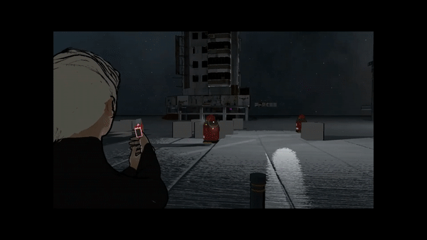

# SafeAndSoundExampleScripts
A collection of scripts demonstrating my work and approaches in creating my indie game Safe And Sound.

Safe And Sound is a cyberpunk stalth shooter in third person. You play as three charater: Ember, Ezra, and Adam. You can switch between them at any given point in time, the two other character will follow the active one or stay put, depending on the command given.

The game is created with Unity3D/C#. The design of the systems follows the Singleton Pattern, which I create and manage in the Awake function. These example scripts show some character controlling, management, and UI scripts.

The derivation is the same for all characters:
- Creature
  - Character
    - PlayerController
      - Ember
      - Ezra
      - Adam
    - NPC
      - MilitaryPolice
      - GenericCivillian

For visual/dev content visist:
https://www.instagram.com/hopelessheartsgames/

